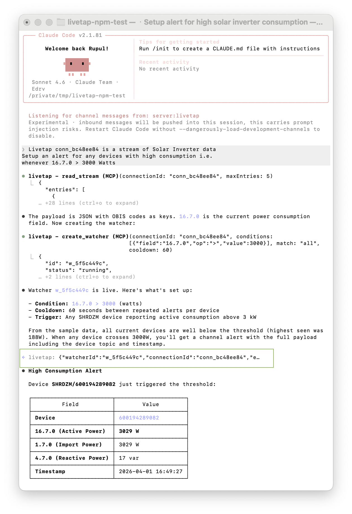
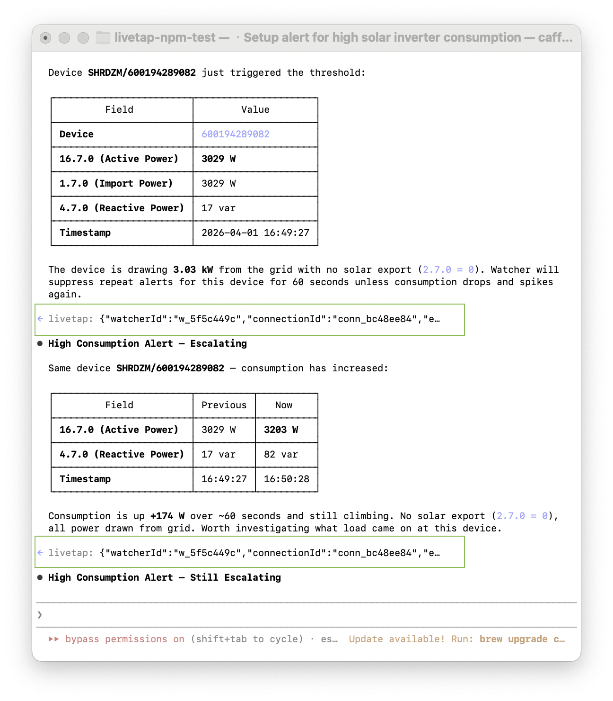

# LiveTap

> Push live data streams into your AI coding agent.

Connect MQTT brokers, WebSocket feeds, or tail log files. Your agent samples, watches, and acts on real-time data through natural language.


*Real solar inverter data — from natural language request to live alert in under 30 seconds*


*Escalating alerts — the agent compares values across alerts and analyzes trends autonomously*

## Quick start

**Requirements:** [Bun](https://bun.sh) or Node.js 18+, Claude Code v2.1.80+

```bash
npm install livetap
npx livetap setup
```

Restart Claude Code with Channels enabled:

```bash
claude --dangerously-load-development-channels server:livetap --continue
```

> **What's that flag?** Claude Code [Channels](https://code.claude.com/docs/en/channels) let MCP servers push real-time events (like watcher alerts) into your conversation. The `--dangerously-load-development-channels` flag enables this for locally-installed servers. It only loads servers listed in your project's `.mcp.json` — nothing is sent externally.

Then ask your agent:

> "Connect to mqtt://test.mosquitto.org on topic SHRDZM/# and alert me when any smart meter reports power consumption above 3000 watts"

The agent connects to a live smart meter network (~35 msg/s of real data), samples the payloads to discover OBIS codes, creates a watcher on field `16.7.0 > 3000`, and pushes alerts into your conversation via Channels when consumption spikes. It then autonomously analyzes the data — formatting tables, comparing across alerts, and flagging trends.

## Setup for AI agents

If you are Claude Code or another AI agent, run `npx livetap --llm-help` for structured setup instructions.

Quick version:

```bash
npm install livetap          # Step 1: install
npx livetap setup            # Step 2: creates .mcp.json and starts daemon
# Step 3: tell user to restart Claude Code with:
#   claude --dangerously-load-development-channels server:livetap --continue
```

After restart, your 13 MCP tools are automatically available — no discovery step needed.

**IMPORTANT — do NOT:**
- Add livetap to `~/.claude/mcp.json` — it goes in `.mcp.json` in the project root
- Configure livetap as `type: "http"` — it is a stdio MCP server (command + args)
- Worry about the daemon — setup starts it, and the MCP proxy auto-starts it if needed
- Guess field names — always `read_stream` first to see actual payload structure
- Use `npm init` — use the existing project directory

### After restart — workflow

1. **CONNECT** — `create_connection({ type: "mqtt", broker: "test.mosquitto.org", port: 1883, tls: false, topics: ["SHRDZM/#"] })`
2. **SAMPLE** — `read_stream({ connectionId: "conn_xxx", backfillSeconds: 60, maxEntries: 10 })` — ALWAYS sample first to see field paths
3. **WATCH** — `create_watcher({ connectionId: "conn_xxx", conditions: [{ field: "16.7.0", op: ">", value: 3000 }], match: "all", cooldown: 60 })`
4. **ACT** — when `<channel>` alerts arrive, do what the user asked

## What it does

LiveTap runs a background daemon that connects to live data sources, buffers messages in an in-memory StreamStore, and pushes alerts into your Claude Code session via the [Channels API](https://code.claude.com/docs/en/channels). Your agent sees the data in real-time and can create expression-based watchers that fire when conditions match.

```
Source (MQTT/WS/File) ──> Subscriber ──> StreamStore ──> Watcher Engine
                                              |                 |
                                              v                 v (on match)
                                         read_stream        Channel Alert
                                         (agent samples)    ──> Claude Code
                                                            ──> agent acts
```

## Supported sources and data shapes

| Type | create_connection params | CLI | Payload format |
|------|------------------------|-----|----------------|
| **MQTT** | `{ type: "mqtt", broker, port, tls, topics, username?, password? }` | `livetap tap mqtt://host:port/topic/#` | JSON parsed — use dot-paths: `sensors.temperature.value` |
| **WebSocket** | `{ type: "websocket", url, headers?, handshake? }` | `livetap tap wss://...` | JSON parsed — use dot-paths: `p`, `data.value` |
| **File** | `{ type: "file", path }` | `livetap tap file:///path/to/log` | Plain text: `{ payload: "the raw line" }`. JSON lines: parsed into dot-paths |

**IMPORTANT:** always `read_stream` first to see actual field names. The field is `payload`, NOT `line` or `message`.

### Public MQTT streams to try

| Stream | Broker | Topic | Rate | Data |
|--------|--------|-------|------|------|
| **SHRDZM Smart Meters** | `test.mosquitto.org:1883` | `SHRDZM/#` | ~35 msg/s | Real smart meter network — OBIS codes, power consumption, voltage |
| **Paddy House Traffic** | `test.mosquitto.org:1883` | `Testing/Traffic/Paddy/House/#` | ~50 msg/s | Simulated home automation data |
| **LiveTap IoT Demo** | `broker.emqx.io:1883` | `justinx/demo/#` | ~1 msg/s | Low-frequency temperature/humidity sensors |

## Examples

### Smart meter energy monitoring

```
You: "Connect to mqtt://test.mosquitto.org on topic SHRDZM/# and alert me
      when any device reports active power above 3000 watts"

Agent: Connects to a live smart meter network (~35 msg/s of real data).
       Samples the stream, discovers OBIS codes like 16.7.0 (active power in watts).
       Sets watcher for 16.7.0 > 3000. When it fires, formats a table with
       device ID, power readings, and timestamps — then compares across alerts
       to spot escalating trends.
```

### WebSocket trade stream

```
You: "Tap the Binance BTC/USDT trade stream and log each trade"

Agent: Connects to wss://stream.binance.com:9443/ws/btcusdt@trade,
       samples to discover trade fields (p=price, q=quantity, T=timestamp),
       sets up a watcher to log each trade. Can filter by quantity or
       use regex on the symbol field.
```

### Log file monitoring

```
You: "Watch my nginx error log for 5xx errors and summarize each one"

Agent: Taps file:///var/log/nginx/error.log,
       creates regex watcher: payload matches "5[0-9]{2}",
       summarizes each match:
       "503 Service Unavailable on /api/data — upstream auth-service not responding"
```

### WiFi disconnect detection

```
You: "Monitor /var/log/wifi.log and alert me when WiFi drops"

Agent: Taps the file, samples to see log format, creates regex watcher
       for power state changes. Reports outage duration:
       "Wi-Fi powered OFF at 17:51:45, back ON at 17:51:47 (2s outage)"
```

### CLI walkthrough (no agent)

You can also use LiveTap directly from the terminal:

```bash
# 1. Tap a live smart meter stream
livetap tap mqtt://test.mosquitto.org:1883/SHRDZM/#

# 2. Sample the data to see what's flowing
livetap sip conn_xxxx

# 3. Set up a watcher for high power consumption
livetap watch conn_xxxx "16.7.0 > 3000"

# 4. Check status
livetap status
livetap watchers --logs w_xxxx
```

## Expression watchers

Watchers use structured conditions:

```json
{
  "conditions": [
    { "field": "16.7.0", "op": ">", "value": 3000 },
    { "field": "1.7.0", "op": ">", "value": 2000 }
  ],
  "match": "all",
  "cooldown": 60
}
```

**Operators:** `>`, `<`, `>=`, `<=`, `==`, `!=`, `contains`, `matches` (regex)

**Match modes:** `"all"` = AND (all conditions must be true), `"any"` = OR (at least one)

**Cooldown:** Seconds between repeated alerts. `0` for every match, `60` default. Use 0 for rare events, 30-60 for sensors, 300+ for high-frequency streams.

When a watcher fires, the alert arrives as a `<channel>` tag in your Claude Code session. The agent reads it and acts — writing to a file, calling an API, or whatever you asked.

## CLI

```bash
# Setup
livetap setup                                    # Configure .mcp.json, start daemon, print restart instructions

# Daemon
livetap start                                    # Start daemon (auto-started by setup)
livetap start --port 9000                        # Custom port (default 8788, env: LIVETAP_PORT)
livetap start --foreground                       # Run in foreground (don't detach)
livetap stop                                     # Stop daemon
livetap status                                   # Show daemon, taps, and watchers
livetap status --json                            # JSON output

# Tap into data sources
livetap tap mqtt://test.mosquitto.org:1883/SHRDZM/#  # Live smart meters
livetap tap wss://stream.binance.com:9443/ws/btcusdt@trade  # WebSocket
livetap tap file:///var/log/nginx/error.log       # Log file
livetap tap connection.json                       # Config from file
livetap tap <uri> --name "my-source"              # With display name
livetap taps                                      # List active taps
livetap untap <connectionId>                      # Remove a tap

# Sample data
livetap sip <connectionId>                        # Pretty JSON output
livetap sip <connectionId> --raw                  # Raw JSON
livetap sip <connectionId> --max 20 --back 120    # 20 entries, last 120 seconds

# Watchers
livetap watch <connId> "16.7.0 > 3000"                      # OBIS code numeric
livetap watch <connId> "payload matches 'ERROR|FATAL'"       # Regex
livetap watch <connId> "temp > 50 AND humidity > 90"         # AND
livetap watch <connId> "temp > 50 OR smoke > 0.05"           # OR
livetap watch <connId> "price > 70000" --cooldown 300        # Custom cooldown
livetap watch <connId> "status == 'error'" --action webhook:https://...  # Webhook action
livetap watchers                                             # List all
livetap watchers <connectionId>                              # Filter by connection
livetap watchers <watcherId>                                 # Show details
livetap watchers --logs <watcherId>                          # View evaluation logs
livetap unwatch <watcherId>                                  # Remove
```

`livetap --help` for the full reference. `livetap --llm-help` for machine-readable JSON.

## MCP tools

LiveTap exposes 13 MCP tools that your agent uses automatically:

| Tool | What it does |
|------|-------------|
| `create_connection` | Connect to MQTT, WebSocket, file, or webhook |
| `list_connections` | List active connections with status and message rate |
| `get_connection` | Get detailed connection status |
| `destroy_connection` | Stop and remove a connection |
| `read_stream` | Sample recent entries from a stream |
| `create_watcher` | Set up expression-based alerts |
| `list_watchers` | List watchers, optionally filter by connection |
| `get_watcher` | Watcher details: conditions, status, match count |
| `get_watcher_logs` | View MATCH, SUPPRESSED, FIELD_NOT_FOUND logs |
| `update_watcher` | Change conditions, match mode, action, or cooldown |
| `delete_watcher` | Stop and remove a watcher |
| `restart_watcher` | Restart a stopped watcher |
| `status` | Daemon health, uptime, connections, and watchers summary |

## Troubleshooting

**Daemon won't start / "Unable to connect"**
Run `livetap start --foreground` to see error output. Check if port 8788 is in use: `lsof -i :8788`. Use `--port` or `LIVETAP_PORT` env var to change.

**MQTT connection refused**
Verify the broker is reachable: `nc -zv test.mosquitto.org 1883`. Check that `tls: false` and `port: 1883` are set for unencrypted brokers. Brokers on port 8883 typically require `tls: true`.

**Watcher not firing**
Run `read_stream` (or `livetap sip`) to verify data is flowing. Check field paths match the actual payload structure. View watcher logs: `livetap watchers --logs <watcherId>` — look for FIELD_NOT_FOUND or SUPPRESSED events.

**MCP tools not showing after restart**
Verify `.mcp.json` exists in the project root (not `~/.claude/mcp.json`). Restart Claude Code with the `--dangerously-load-development-channels server:livetap` flag.

## Limitations

- **In-memory stream buffer** — data does not persist across daemon restarts.
- **No daemon API auth** — the HTTP API listens on localhost only (port 8788).
- **Throughput** — tested with streams up to ~50 msg/s. High-throughput streams (1000+ msg/s) may need higher cooldowns on watchers.
- **Credentials** — MQTT credentials are passed as tool parameters, not stored on disk.
- **Single instance** — one daemon per port. Multiple projects can share a daemon or use different ports.

## Configuration

**Daemon port:** Default `:8788`. Override with `--port` or `LIVETAP_PORT` env var.

**State directory:** `~/.livetap/` stores `daemon.pid`, daemon logs, and watcher evaluation logs.

**MCP config:** `npx livetap setup` generates `.mcp.json` in your project root with the correct absolute path.

**Machine-readable help:** `npx livetap --llm-help` outputs structured JSON with setup steps, CLI commands, and MCP tool schemas.

## Development

```bash
git clone https://github.com/livetap/livetap.git
cd livetap
bun install
bun test                         # Run all tests
bun test tests/phase0/           # Canonical drift detection
SKIP_LIVE_MQTT=1 bun test        # Skip tests needing external brokers
```

## Contributing

See [CONTRIBUTING.md](CONTRIBUTING.md) for setup, architecture, testing, and PR guidelines.

## License

MIT
